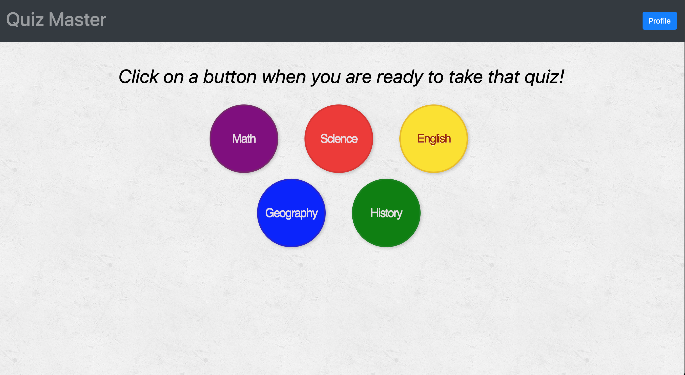
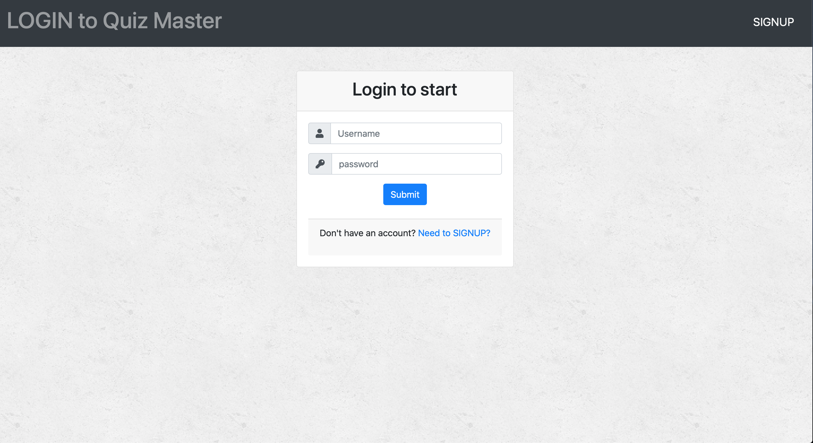
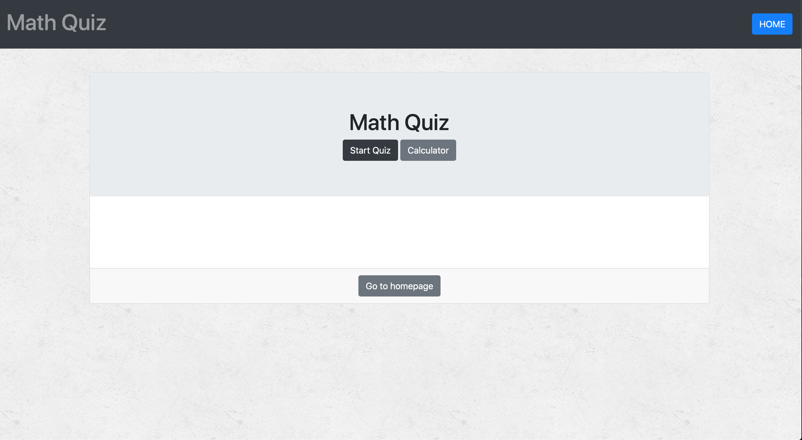
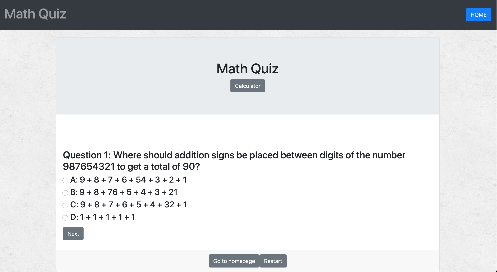
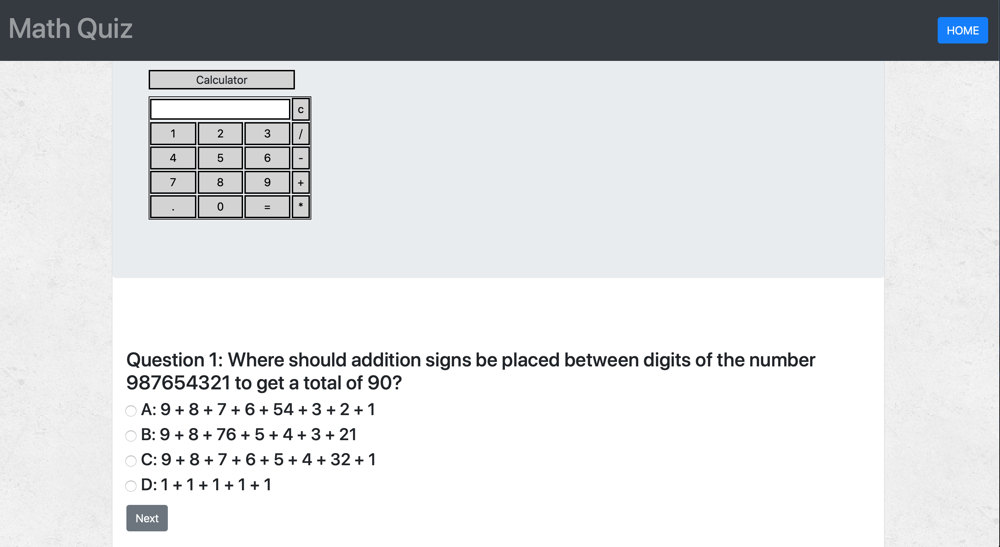
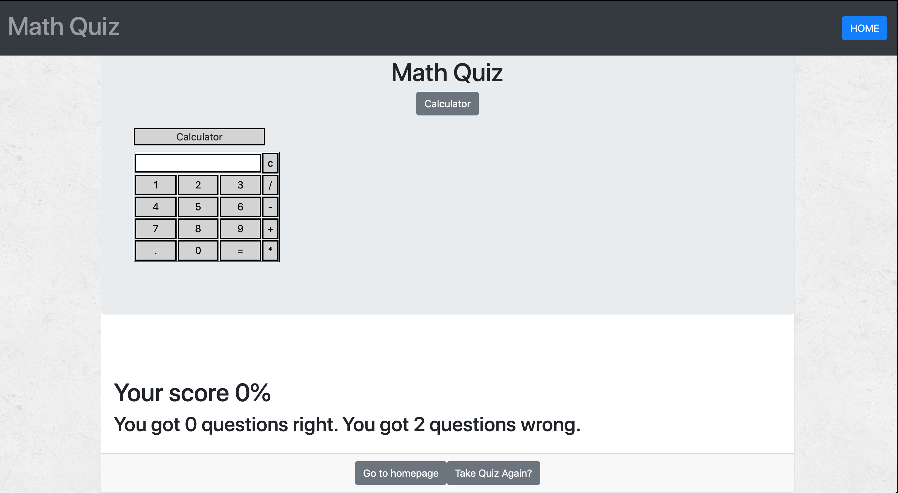
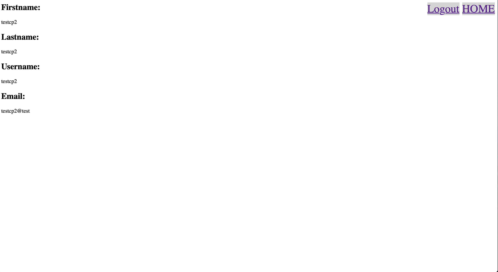

# Quiz_Master

A Mongoose, Express, Node authentication app. Simply done for learning purposes.

## Table of contents
  * [Live](#live)
  * [About this project](#about-this-project)
  * [Getting started](#getting-started)
  * [Structure of the project](#structure-of-project)
   * [Screenshots](#screenshots)
  * [Technologies used to create app](#technologies-used)
  	* [Backend technologies](#Backend)
  	* [Frontend technologies](#Frontend)
  * [Design improvements](#design-improvements)
  * [Acknowledgments](#Acknowledgments)
  * [Issues](#Issues)

## Live
https://rocky-caverns-23442.herokuapp.com/

##  About this project

  * [How the app works](#how-app-works)
  * [How the app is built](#how-the-app-is-built)
 
###  How the app works
This project allows a user to signup for the quiz service. Then, the user can login to the website with their stored credentials.

###  How the app is built
This project uses Mongodb(Mongoose), Node, Express. Node and Express are used to query and route data in the application. Express is the backend web framework used for this application, and HTML on the frontend.

##  Getting started
The following section will take you through the steps of setting up this application and getting it running locally on your computer.

To set up this application locally on your computer, perform the following steps:
  1. [Clone the repository](#clone-repository)
  2. [Install Node.js](#install-node)
  3. [Install the dependencies](#dependencies)
  4. [Install Mongodb](#install-mongodb)
  5. [Set up a development database](#database-setup)
  6. [Verify database connection information](#db-connect)
  7. [Start the server](#start-server)

###  1. Clone the repository
The first step is to clone the project repository to a local directory on your computer. To clone the repository, run the following commands:
<pre>
  git clone https://github.com/CeaserSP/QuizMaster.git
  cd QuizMaster
</pre>

####  Structure of the project

After you clone the repository, navigate to the project root directory. The project directory structure is set up as follows:

<ul>
  <li> 
    
<b>server.js</b>: This file does the following:

		<ul>
	    	<li>Defines and requires the dependencies, including express, morgan, and mongoose.</li>
	    	 <li>Sets up the Express server.</li>
	    	 <li>Sets up the Express server to handle data parsing using body-parser.</li>
	    	 <li>Points the server to the API routes, which gives the server a map of how to respond when users visit or request data from various URLs.</li>
         <li>Defines the port the server is listening on.</li>
	    	 <li>Starts the server.</li>
         <li>Allows the app to serve static content from the public directory.</li>
    	</ul>
  <li>
    
<b>public</b>: Contains the static content (images, Javascript, and CSS). 

    
<b>privateViews</b>: Contains the static content that can only be seen when user is logged in. 

    
The login.html and signup.html are forms that post to their respective routes on submit. Routes are in server.js

  </li>
  <li>
    
<b>models</b>: Contains a file called <b>user.js</b>, which contains the schema sent to the database, functions used to manage the application data and interact with the database.

  </li>
  <li><b>package.json</b>: Lists the project dependencies (third party npm packages) and their version numbers.</li>
  <li><b>.gitignore</b>: Anything listed inside this file will not be tracked by GitHub when code is committed.</li>
  <li><b>package-lock.json</b>: Dependency tree for the project. Lists all the dependencies and their versions.</li>
</ul>

###  2. Install Node.js

If you don't already have Node.js installed on your computer, you can install the latest version here: https://nodejs.org/en/.

###  3. Install the dependencies

The following npm packages are dependencies to the project.

After you clone the repository to a local directory, change directory to the project root directory and run the following command to install the required npm packages:

<pre>npm install</pre>
<ul>
	<li><b>express</b> -  a Node.js web application framework (https://www.npmjs.com/package/express).</li>
	<li><b>logger</b> - HTTP request logger middleware for node.js. (https://www.npmjs.com/package/morgan)</li>
	<li><b>mongoose</b> - Mongoose is a MongoDB object modeling tool designed to work in an asynchronous environment. Mongoose supports both promises and callbacks. (https://www.npmjs.com/package/mongoose).</li>
    <li><b>bcrypt</b> - Dependency of user.js - A library to help you hash passwords. (https://www.npmjs.com/package/bcrypt)</li>
    <li><b>client-sessions</b> - Dependency of server.js - client-sessions is connect middleware that implements sessions in encrypted tamper-free cookies.. (https://www.npmjs.com/package/client-sessions)</li>
</ul>

Version information for each of these packages is available in the <b>package.json</b> file in the project root directory.

###  4. Install MongoDB

If you don't already have MongoDB installed on your computer, you can install the latest version here: https://docs.mongodb.com/v3.0/tutorial/install-mongodb-on-os-x/

For this project, Mongoose shell is used to visually design, create, and manage the database used to store user data.

###  5. Set up a development database
To set up a development database that you can use with this application, perform the following steps:
<ol>
<li>
Open a terminal window run <b>mongod</b>. Then open another terminal window and run <b>mongo</b>. https://docs.mongodb.com/manual/mongo/
</li>
<li>
Execute the following statements in mongo shell:

  <pre>
  create database by doing:  use databasename_db;
  switch to new db: use databasename_db;
  </pre>
  
Running these statements creates a database called <b>databasename_db</b> and sets it as the current database being used.

</li>
<li>
  
Execute the following statement to create a collection called <b>User</b>.

  <pre>
  db.User.insert({"username":"test","password":"1234567"})
  </pre>
  
To show database content do: db.User.find().pretty()

Setting up userSchema go to models/user.js. This holds the functions, password encryption and comparisons and schema to be sent to the database.
</li>
</ol>

### <a name="db-connect">6. Verify database connection information</a>

Modify the connection properties as needed to reflect your database instance.

For example:

<pre>
 var connStr = 'mongodb://localhost:27017/mon_auth';
mongoose.connect(connStr, { useNewUrlParser: true }, function (err) {
  if (err) throw err;
  console.log('Successfully connected to MongoDB');
});
</pre>

### <a name="start-server">7. Start the server</a>

After performing all of the setup steps in the <b>Getting started</b> section, navigate to the project root directory (burger) and run the following command to start the server:

<pre>
node server.js
</pre>

To verify that the server has started and the application is working locally on your computer, open Chrome and go to <a href="http://localhost:8080">http://localhost:8080</a>.

##  Screenshots

### Welcome to Quiz Master

 

##  Technologies used to build app
* [Backend technologies](#Backend)
* [Frontend technologies](#Frontend)

###  Backend technologies
* Node.js (https://nodejs.org/en/)
* Mongoose (https://www.npmjs.com/package/mongoose)
* Express (http://expressjs.com/)
* bcrypt (https://www.npmjs.com/package/bcrypt)
* morgan (https://www.npmjs.com/package/morgan)
* client-sessions (https://www.npmjs.com/package/client-sessions)
###  Frontend technologies
* HTML
* CSS
* Javascript
* Font Awesome API

##  Design improvements
* Add admin status.
* Utilize React
* Allow admin to create their own quizzes and allow users to find them.
* Allow admin to get user results
* Add user results to profile page.

##  Acknowledgments

These are the two sources I used to create this application:
Primary Source: <a href="https://www.tutorialspoint.com/expressjs/expressjs_authentication.htm">https://www.tutorialspoint.com/expressjs/expressjs_authentication.htm</a>

Secondary source:<a href="https://stormpath.com/blog/everything-you-ever-wanted-to-know-about-node-dot-js-sessions">https://stormpath.com/blog/everything-you-ever-wanted-to-know-about-node-dot-js-sessions</a>

Resource for calculator: https://www.geeksforgeeks.org/html-calculator/
 

This application was a remake of a previous group project. If you would like to see that go here:<a href="https://github.com/jboe26/quizzly">https://github.com/jboe26/quizzly</a>.

If you would like to see how I set up authentication go here: <a href="https://github.com/CeaserSP/Mongoose_Authentication" target="_blank">https://github.com/CeaserSP/Mongoose_Authentication</a>. Use in conjunction with the secondary source above.

##  Issues

If you find an issue while using the app or have a request, <a href="https://github.com/CeaserSP/QuizMaster/issues" target="_blank">log the issue or request here</a>. These issues will be addressed in a future code update.

